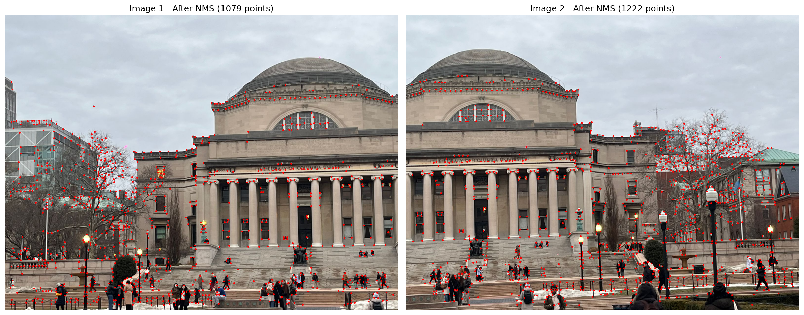
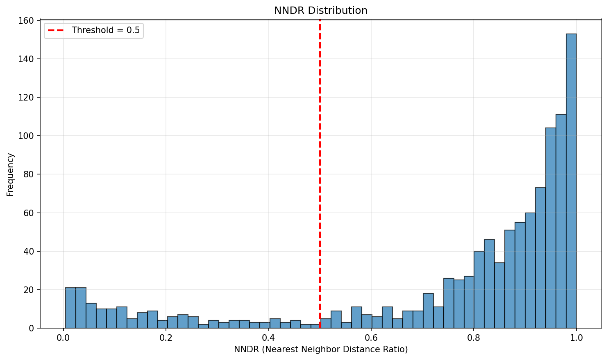
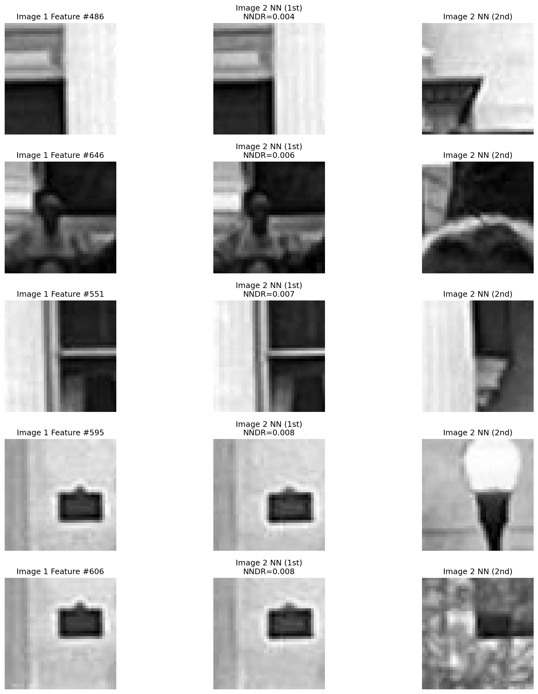
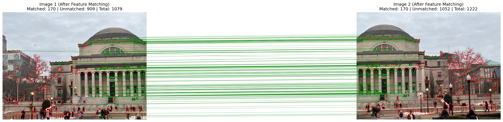

Perfect, that makes sense — you want **one tight, concrete README** that references *one specific input pair and its output*, so anyone opening your GitHub can immediately see what your code does. Here’s a **single, paste-ready `README.md`** you can drop into your repo and just replace the image filenames if needed.

```md
# 🖼️ Automatic Feature Matching (Harris Corners + NNDR)

This repository implements a classical **feature matching pipeline** to find correspondences between two images using Harris corners and Nearest Neighbor Distance Ratio (NNDR).  
The pipeline detects interest points, extracts patch-based descriptors, and matches features across images.  
Results are visualized in an auto-generated HTML report.

---

## 🔍 Example: Single Test Case

**Input Images**

| Image 1 | Image 2 |
|--------|---------|
|  |  |

> These are the two input images used for the example below.

---

## 🧠 Pipeline Overview

**Harris Corners → NMS → Feature Descriptors → NNDR Matching (SSD)**

1. **Harris Corner Detection**  
   Detects interest points in both images.

2. **Non-Maximal Suppression (NMS)**  
   Removes redundant nearby corners.

3. **Feature Descriptors**  
   - Extract 40×40 patches  
   - Downsample to 8×8  
   - Apply anti-aliasing and normalization  
   → 64D descriptor per keypoint.

4. **Feature Matching (NNDR)**  
   - Distance metric: **SSD (Sum of Squared Differences)**  
   - NNDR threshold: **0.5**  
   - Filters ambiguous matches.

---

## 📊 Output (for the Example Above)

**Harris Corners (after NMS)**  


**NNDR Histogram (with threshold = 0.5)**  


**Top-5 Best Matches (1NN vs 2NN)**  


**Final Feature Matches (Visualization)**  


> Green lines = matched features  
> Red dots = unmatched / rejected features

---

## ▶️ How to Reproduce

1. Place your input image pair in:

```

input/
├── scene1_img1.jpg
└── scene1_img2.jpg

```

2. Run your pipeline to generate results in:

```

output/scene1/
├── 1_corners_detected.png
├── 2_corners_nms.png
├── 3_nndr_histogram.png
├── 4_top_matches.png
└── 5_matches_lines.png

````

3. Generate the HTML report:

```bash
python web.py
````

4. Open:

```
output/index.html
```

---

## 🛠️ Tech Stack

* Python
* OpenCV
* NumPy
* scikit-image
* Matplotlib

---

## ⚙️ Parameters

* Harris sigma: `1.5`
* Harris threshold: `0.10 * max_response`
* NMS window: `20 × 20`
* Patch size: `40 × 40 → 8 × 8`
* NNDR threshold: `0.5`
* Distance metric: `SSD`

---

## 🎯 Takeaways

* Harris corners capture strong structural points.
* NNDR filters ambiguous matches effectively.
* Patch descriptors provide visually consistent matches across views.

---

## 📌 Notes

This project demonstrates a **classical computer vision feature matching pipeline** and provides clear qualitative and quantitative visualizations of matching quality.


If you paste your actual folder names (or screenshot your repo structure), I’ll align the paths perfectly so the images render on GitHub the first time.
```
